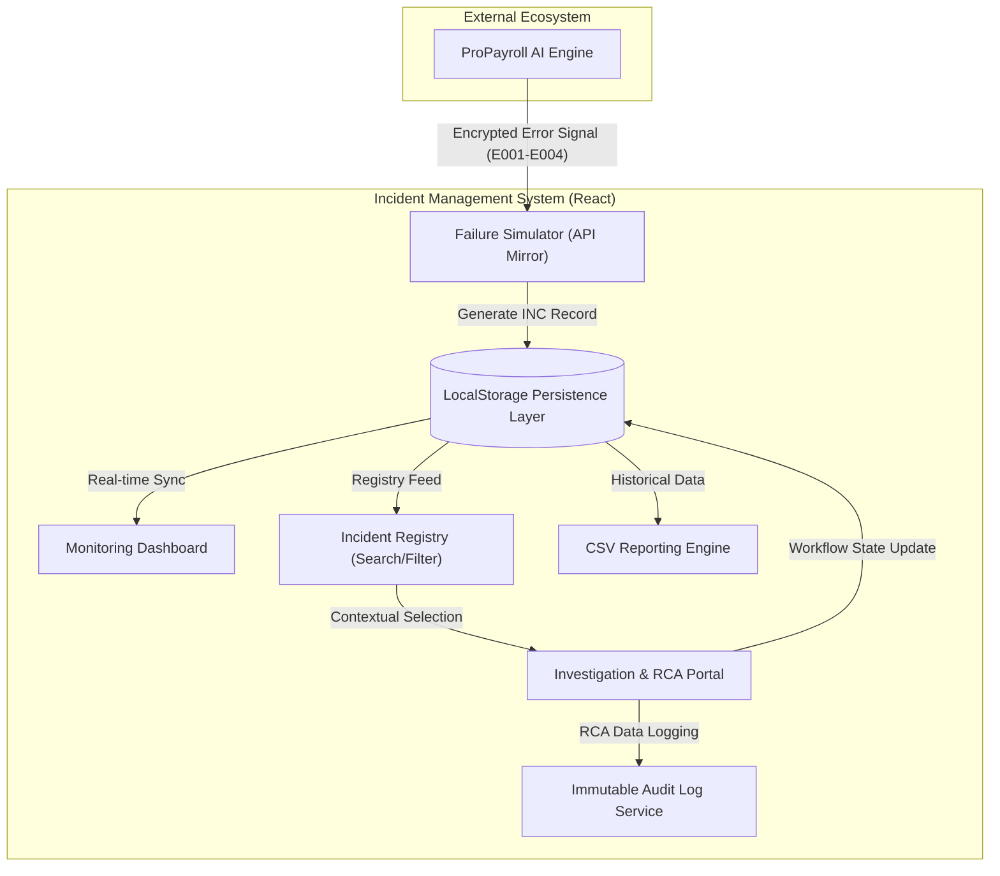
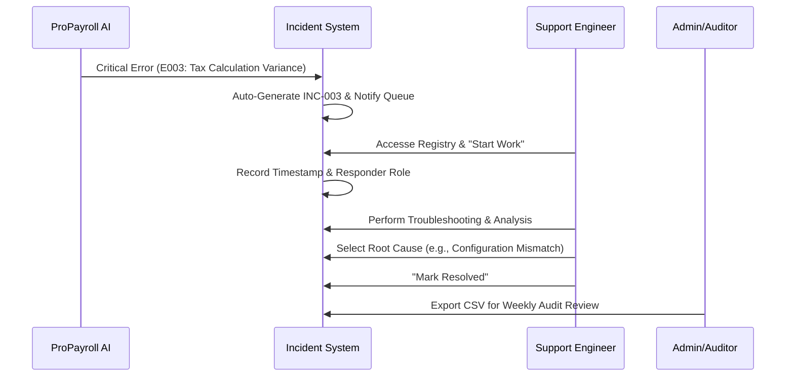

# Incident Management & Troubleshooting System (IMTS)

[](https://reactjs.org/)
[](https://vitejs.dev/)
[](https://tailwindcss.com/)
[]()

A high-fidelity operational portal engineered for **ProPayroll AI** Support & Operations. This system manage technical disruptions through a standardized lifecycle—from automated incident reception to mandatory root cause analysis and resolution auditing.

---

## 🏛️ System Architecture

The IMTS is designed as a decoupled support tier that integrates seamlessly with core payroll engines to ensure high "System Availability" and compliance.



---

## 💼 Business Intelligence: The Problem & Solution

### **The Challenge**
In large-scale fintech environments (like Deloitte payroll clients), manual tracking of system failures leads to **Data Silos**, **Audit Failures**, and **Increased Downtime**. Without a structured RCA (Root Cause Analysis) framework, recurring bugs are rarely fixed at the source.

### **The Solution**
The IMTS addresses these challenges by:
- **Centralizing Failure Signals**: Converting technical errors into actionable business incidents.
- **Enforcing Accountability**: Mandatory Root Cause Analysis ensure every fix is justified and documented.
- **Ensuring Compliance**: An immutable audit trail captures every responder action for regulatory review.

---

## 🔄 Operational Workflow

The following sequence illustrates the end-to-end lifecycle of a critical payroll failure:



---

## 🚀 Core Functionalities

> [!TIP]
> Use the **"Simulate Payroll Failure"** button on the Dashboard to demonstrate real-time data reception from the payroll engine.

| Feature | Description | Business Value |
| :--- | :--- | :--- |
| **Simulated Integration** | API Mirror receiving signals from ProPayroll AI. | Demonstrates End-to-End system thinking. |
| **Standardized Lifecycle** | Open → In Progress → Resolved workflow. | ensures engineering rigor and process control. |
| **Mandatory RCA** | Predefined root cause selection for every ticket. | Eliminates "guesswork" and targets permanent fixes. |
| **Immutable Audit Logs** | chronological trail of all responder actions. | Essential for regulatory compliance and accountability. |
| **CSV Export Engine** | Dynamic data extraction for stakeholder reporting. | Facilitates data-driven operational decisions. |

---

## 🛠️ Technical Stack

| Category | Technology | Purpose |
| :--- | :--- | :--- |
| **Frontend Framework** | React 18 / Vite | High-performance, modular UI with HMR. |
| **Styling Engine** | Tailwind CSS v3 | Utility-first design for professional UI consistency. |
| **Persistence** | Browser LocalStorage | Local data integrity without backend dependency. |
| **Iconography** | Lucide-React | Industry-standard vector iconography. |
| **Visualization** | Mermaid.js | Technical architecture and workflow modeling. |

---

## ⚡ Setup & Deployment

> [!NOTE]
> This project is designed as a standalone "Frontend + Storage" demo for portability during interviews.

1.  **Clone & Install**:
    ```bash
    npm install
    ```
2.  **Run Development Server**:
    ```bash
    npm run dev
    ```
3.  **Build for Production**:
    ```bash
    npm run build
    ```

---

## 🎓 Interview Talking Points
- **System Stability**: Discuss how this portal reduces **MTTR (Mean Time To Resolution)** by mapping technical error codes to business context.
- **Consulting Mindset**: Explain how the **Audit Trail** and **RCA Module** align with the compliance-heavy requirements of Deloitte's clients.

---

Designed for Professional Excellence in Support Operations.
